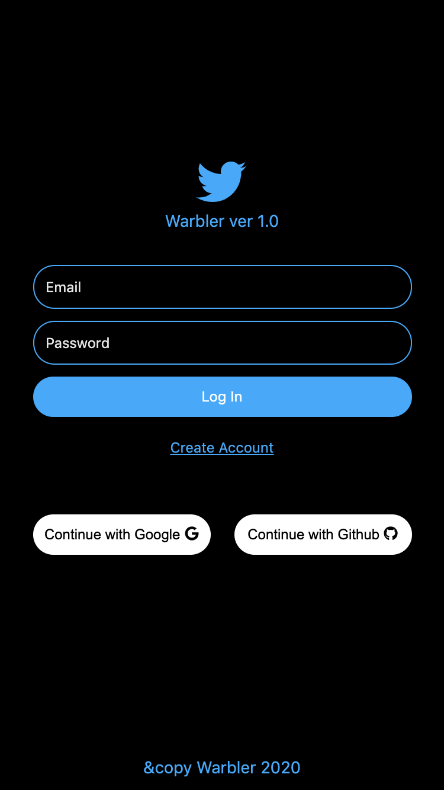
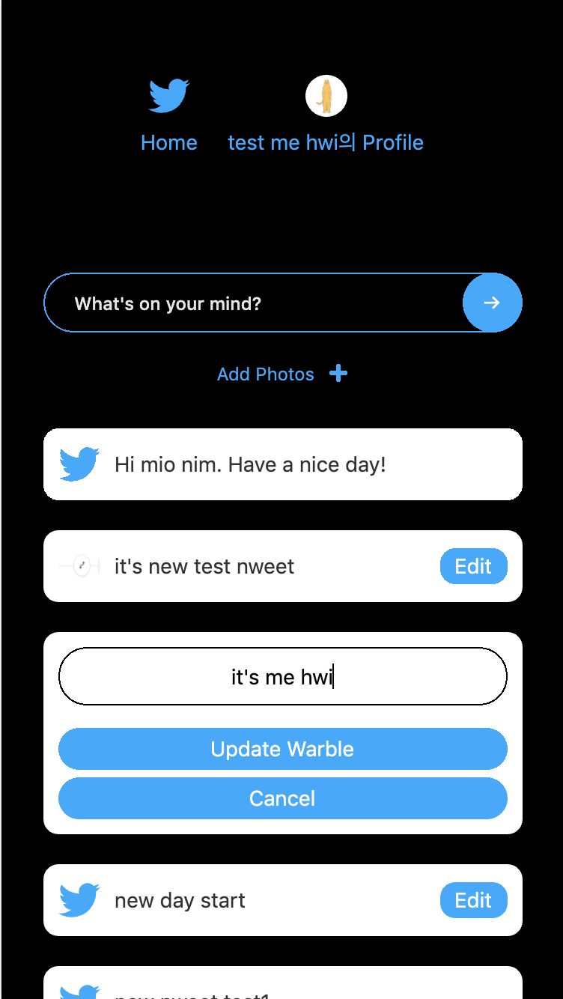
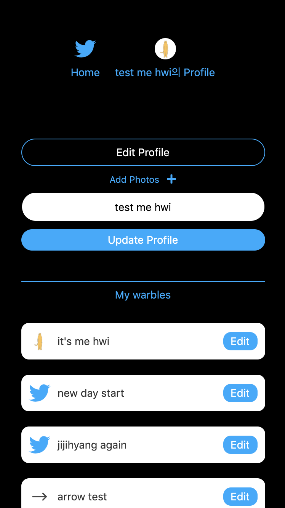

This project was bootstrapped with [Create React App](https://github.com/facebook/create-react-app).

## Service Title

Warbler

### Screenshot

</img>
</img>
</img>

### Description

Warble to your family, friend, colleague, and anyone!

### Deploy

[https://gibaek-lee.github.io/warbler](https://gibaek-lee.github.io/warbler) 

### Tech Stack

Back-end: Firebase - Authentication, Cloud firestore, Storage Front-end: React, React Hooks

### Reference

[Nomad Coders - 트위터 클론코딩](https://nomadcoders.co/nwitter)

### Announcement

Found errors, please publish issues.